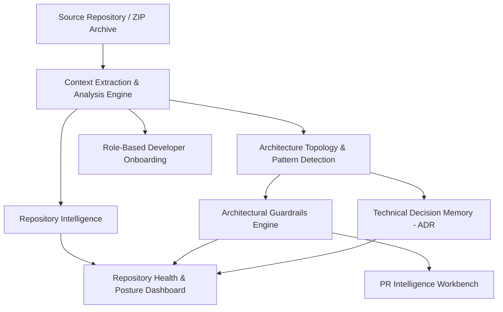
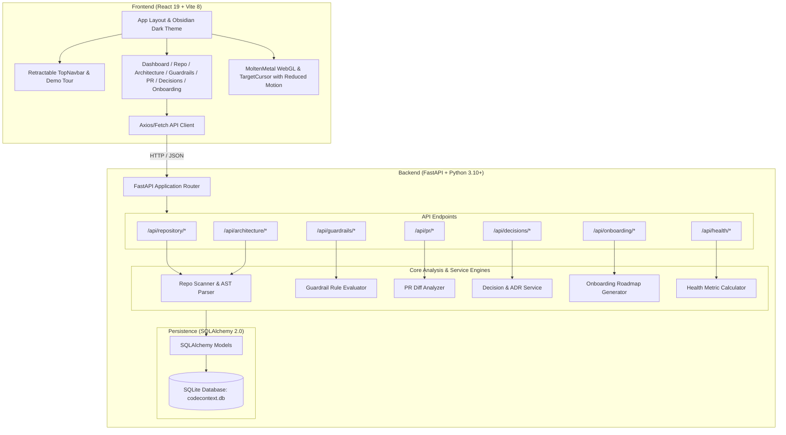

# CodeContext AI

> Repository intelligence for understanding architecture, enforcing engineering guardrails, reviewing changes, preserving technical decisions, and accelerating developer onboarding.

[](https://www.python.org/)
[](https://fastapi.tiangolo.com/)
[](https://react.dev/)
[](https://vitejs.dev/)
[](https://www.sqlite.org/)
[](./package.json)

CodeContext AI is an open-source codebase intelligence platform designed for software engineering teams and technical reviewers. It inspects local repositories or compressed project archives, reconstructs their architectural layers and design patterns, enforces system boundaries through automated guardrails, assesses pull request diffs for architectural risk, preserves team architectural decisions (ADRs), and generates structured, personalized developer onboarding roadmaps.

---

## 1. Overview

### What is CodeContext AI?
CodeContext AI turns raw source code into persistent, queryable engineering context. Rather than treating code as disconnected text files or relying on transient chat queries, CodeContext AI models a repository's structural tiers, dependency boundaries, architectural rules, and technical decisions as an interconnected graph.

### Who is it for?
* **Software Engineers & Tech Leads**: Who need to maintain architectural boundaries, understand unfamiliar codebases, and ensure incoming pull requests do not bypass established design patterns.
* **Reviewers & Engineering Managers**: Who require objective risk assessments on PRs, visibility into technical debt, and a centralized audit trail of architectural decisions.
* **New Team Members**: Who need structured, role-specific guidance to understand system architecture, locate starter files, and complete their first contributions without getting overwhelmed.

### Product Workflow


---

## 2. The Problem

Modern software development teams face severe knowledge fragmentation:
* **Fragmented Repository Knowledge**: Vital system knowledge is scattered across Git history, unmaintained wiki pages, Slack threads, and oral memory.
* **Architecture Obscurity**: As systems grow, original service boundaries and dependency constraints blur, leading to circular imports, tight database coupling, and layer bypassing.
* **Inconsistent Engineering Patterns**: Different developers introduce ad-hoc abstractions, redundant client SDK calls, or custom validation instead of reusing established project patterns.
* **Architectural Violations in Pull Requests**: Reviewers easily miss subtle architectural erosion during code review—such as an API route querying an ORM directly instead of delegating to a repository layer.
* **Lost Technical Decisions**: Teams regularly revisit answered questions or undo deliberate trade-offs because the original Architecture Decision Records (ADRs) were never captured or connected to code.
* **Protracted Onboarding Times**: New hires spend days or weeks reading scattered code without knowing the critical paths, dependency boundaries, or starter tasks.

---

## 3. The Solution

CodeContext AI establishes a persistent context layer around the codebase:

| Capability | What CodeContext AI Provides |
| :--- | :--- |
| **Repository Analyzer** | Multi-language scanning, framework detection, dependency audit, file categorization, and structural metrics. |
| **Architecture Topology** | Interactive component graph mapping API, service, repository, database, cache, and queue layers with detected design patterns. |
| **Architectural Guardrails** | Automated detection of boundary violations (e.g., direct DB queries in route handlers, unvalidated dicts, hardcoded secrets) with concrete remediation advice. |
| **PR Intelligence** | Unified diff risk scoring (0–100), violation detection, reviewer questions, suggested fixes, and targeted test recommendations. |
| **Decision Memory** | Structured Architecture Decision Record (ADR) repository with manual creation and heuristic text extraction from commit messages and notes. |
| **Developer Onboarding** | Dynamic 4-phase curriculum tailored to developer role, seniority level, and target domain, complete with starter tasks and recommended files. |
| **Repository Health** | Multi-factor composite health score evaluating architecture stability, documentation presence, dependency risk, open guardrail violations, and technical debt. |

---

## 4. Key Features

### Repository Intelligence
The repository scanner traverses local directories or uploaded project ZIP files (up to 50MB) while filtering common vendor, cache, and build directories.
* **Language Composition**: Detects file counts and source percentages across 20+ file extensions (Python, TypeScript, JavaScript, SQL, YAML, Markdown, etc.).
* **Framework Detection**: Scans file contents and package manifests for framework signatures including FastAPI, React, SQLAlchemy, Alembic, Celery, Redis, pytest, Vite, Express, and Django.
* **Dependency Auditing**: Parses dependencies from `requirements.txt` and `package.json`, classifying packages into runtime and development dependencies.
* **Component Extraction**: Maps directories and source files into logical system tiers.
* **Risk Discovery**: Flags preliminary structural risks such as tight database coupling or missing rate limiting.

### Architecture Intelligence
Visualizes the architectural tiers and data flows of the repository as an interactive topology:
* **Component Tiers**: Classifies components across API, Service, Repository, Database, Cache, External Integrations, and Task Queues.
* **Edge Mapping**: Displays dependencies and communication pathways between services and databases.
* **Design Pattern Detection**: Automatically detects architectural conventions such as the Repository Pattern, Service Layer Pattern, JWT Authentication, and Event-Driven Task Queues with confidence ratings.
* **Rule Authoring**: Allows teams to create custom architecture rules and assign severities to protect specific repository boundaries.

### Architectural Guardrails
Continuous boundary enforcement that alerts developers before code changes degrade system design:
* **Rule Evaluation**: Evaluates code against rules across Layered Architecture, Security, Modularity, and Input Validation categories.
* **Severity Levels**: Classifies violations into `HIGH`, `MEDIUM`, and `LOW` severities.
* **Detailed Diagnostics**: Reports exact file path, line number, violation explanation, and concrete remediation code snippets.
* **Status Tracking**: Allows marking violations as `open`, `resolved`, or `ignored`.

### PR Intelligence Workbench
A dedicated review pre-flight workspace for pull requests and diffs:
* **Risk Score & Level**: Computes an automated risk score (0–100) and severity rating (`CRITICAL`, `HIGH`, `MEDIUM`, `LOW`).
* **Multi-Format Input**: Accepts raw unified diff strings, file uploads (`.diff` or `.patch`), or pre-configured demonstration PRs.
* **Violation Highlights**: Pinpoints hardcoded credentials, direct database queries in handlers, unvalidated request payloads, and unhandled external SDK calls directly in the diff.
* **Reviewer Prompts**: Generates targeted engineering questions for code reviewers (e.g., verifying transaction idempotency or checking error rollbacks).
* **Suggested Fixes & Test Cases**: Recommends explicit code changes and missing unit/integration test specifications.

### Technical Decision Memory (ADR)
Captures and maintains technical decisions to eliminate knowledge churn:
* **Structured ADR Fields**: Preserves title, context, problem statement, chosen approach, considered alternatives, engineering reasoning, affected components, decision date, and status.
* **Heuristic Text Extraction**: Parses unstructured notes, Slack discussion snippets, commit messages, or PR summaries into structured ADR records using rule-based text extraction.
* **Full CRUD Lifecycle**: Create, view, update, and delete decisions tied to specific repositories.

### Developer Onboarding Generator
Generates personalized, structured onboarding curricula directly from repository metadata:
* **Custom Persona Matrix**: Configurable by role (`backend`, `frontend`, `fullstack`, `devops`, `qa`, `data`), seniority level (`junior`, `mid`, `senior`), existing known technologies, and target project area.
* **Structured 4-Phase Curriculum**:
  * Phase 1: Environment Setup & Architecture Foundations (Day 1)
  * Phase 2: Core Domain Deep-Dive & Pattern Exploration (Days 2–3)
  * Phase 3: First Starter Tasks & Guided Contributions (Week 1)
  * Phase 4: Independent Feature Delivery & Best Practices (Week 2+)
* **Curated Resources**: Selects relevant entry-point files, documentation links, and concrete starter exercises.

### Repository Health Dashboard
A composite metric evaluating code health across 6 distinct indicators:
1. **Architecture Health**: Component modularity and design pattern adherence.
2. **Test Coverage Indicator**: Heuristic detection of test suites and test directory scaffolding.
3. **Documentation Coverage**: Presence and thoroughness of project documentation and README files.
4. **Dependency Risk**: Ratio of third-party dependencies to manageable thresholds.
5. **Guardrail Violations**: Weighted penalty metric based on active HIGH and MEDIUM severity violations.
6. **Technical Debt Indicator**: Assessment of architectural risk hotspots and unvalidated handlers.

---

## 5. Demo Experience

For hackathon judges and technical reviewers, CodeContext AI provides a guided, self-contained demonstration using the built-in **ShopFlow Platform** dataset.

```text
[Step 1: Load ShopFlow Demo]
       │
       ▼
[Step 2: Repository Analyzer] ──► Inspect 83 files, 15 dependencies, 6 architecture patterns
       │
       ▼
[Step 3: Architecture Topology] ──► Explore 9 layered components from API to PostgreSQL & Redis
       │
       ▼
[Step 4: Guardrail Violations] ──► Audit 5 detected violations (3 HIGH, 2 MEDIUM)
       │
       ▼
[Step 5: PR Intelligence] ──► Analyze PR #142 (Stripe Key & DB bypass) ──► Risk: 87/100 (CRITICAL)
       │
       ▼
[Step 6: Decision Memory] ──► Review 3 active ADRs (JWT, Celery, Repository Pattern)
       │
       ▼
[Step 7: Developer Onboarding] ──► Generate role-tailored curriculum for a Mid-level Backend Engineer
```

An interactive **Demo Tour** modal is accessible directly from the Top Navigation Bar, walking reviewers through each capability step-by-step.

---

## 6. Built-in Demo Repository: ShopFlow Platform

The system includes a fully realized eCommerce simulation (`repo-shopflow-demo`) with deterministic real-world architectural scenarios:

* **Codebase Scale**: 83 files, 12,847 lines of code across 13 directories.
* **Languages**: Python (45.2%), TypeScript (32.1%), SQL (10.3%), YAML (7.1%), Markdown (5.3%).
* **Stack**: FastAPI, React 18, SQLAlchemy, Redux, Vite, Celery, Redis, PostgreSQL.
* **Components (9)**: API Layer, Services Layer, Repository Layer, Auth Layer, Frontend SPA, PostgreSQL Database, Redis Cache, Stripe Payment API, and Task Queue (Celery).
* **Detected Patterns (6)**: Repository Pattern (0.92 confidence), Service Layer Pattern (0.88), JWT Authentication (0.97), Event-Driven Async Tasks (0.84), RESTful API Design (0.91), and Alembic Migrations (0.95).
* **Built-in Guardrail Violations (5)**:
  * `HIGH`: API route directly querying DB (`src/api/routes/users.py:47`).
  * `HIGH`: API route executing direct DB commit and payment processing (`src/api/routes/orders.py:112`).
  * `HIGH`: Unvalidated raw dict accepted in POST route (`src/api/routes/products.py:23`).
  * `MEDIUM`: Hardcoded database connection string (`src/api/main.py:8`).
  * `MEDIUM`: Direct third-party SDK call bypassing service abstraction (`src/services/order_service.py:89`).
* **Preserved Technical Decisions (3)**:
  * ADR-001: *Use JWT for Stateless Authentication* (Short-lived tokens in HttpOnly cookies).
  * ADR-002: *Celery + Redis for Background Task Processing* (Non-blocking order and email jobs).
  * ADR-003: *Repository Pattern for Database Abstraction* (Decoupled ORM access for testability).
* **Intentionally Problematic Demo PR**:
  * Title: `feat: Add checkout endpoint with Stripe payment` (`src/api/routes/orders.py`).
  * Score: **87/100 (CRITICAL Risk)**.
  * Faults: Live Stripe API key committed in source, inline checkout bypassing OrderService, unvalidated request dict, direct database commit without transaction isolation.

---

## 7. Technical Architecture



---

## 8. Project Structure

```text
codecontext-ai/
├── backend/
│   ├── main.py                  # FastAPI application entry point, CORS, routers & lifespan
│   ├── database/
│   │   └── connection.py        # SQLAlchemy engine, session maker & SQLite schema initialization
│   ├── models/
│   │   ├── db_models.py         # SQLAlchemy ORM entities (Repository, Rules, Violations, ADRs, PRs)
│   │   └── schemas.py           # Pydantic v2 schemas for request validation & API responses
│   ├── api/                     # Modular FastAPI routers
│   │   ├── repository.py        # Scan, upload, list, get, delete, demo loader
│   │   ├── architecture.py      # Architecture components, dependency rules
│   │   ├── guardrails.py        # Rule violations query, filtering & status updates
│   │   ├── pr_intelligence.py   # PR diff analysis, uploads, demo PR, history
│   │   ├── decisions.py         # Technical decision memory CRUD & text extraction
│   │   ├── onboarding.py        # Dynamic onboarding plan generation & history
│   │   └── health.py            # Comprehensive repository health scoring
│   ├── analyzers/               # Domain-specific analysis logic
│   │   ├── repo_scanner.py      # Filesystem walker, language classifier & framework signatures
│   │   ├── guardrail_analyzer.py # Architecture rule violation heuristics & pattern matchers
│   │   └── pr_analyzer.py       # Unified diff parsing, risk scoring & reviewer questions
│   ├── services/                # Business logic orchestration
│   │   ├── repository_service.py # Local/ZIP scanning & demo repository bootstrapping
│   │   ├── decision_service.py   # Decision persistence & heuristic text extraction
│   │   └── onboarding_service.py # Role-based curriculum generation
│   └── data/
│       └── demo_data.py         # Built-in ShopFlow Platform deterministic dataset
├── frontend/
│   ├── src/
│   │   ├── App.jsx              # Root layout, routing, wallpaper, loader & global state
│   │   ├── main.jsx             # React 19 application entry point
│   │   ├── index.css            # Dark Obsidian developer-tool design system & tokens
│   │   ├── services/
│   │   │   └── api.js           # API client with fallback to localhost:8000
│   │   ├── pages/
│   │   │   ├── Dashboard.jsx    # Health posture, quick metrics & audit cards
│   │   │   ├── RepositoryPage.jsx # Codebase file browser, tech stack & dependencies
│   │   │   ├── ArchitecturePage.jsx # SVG topology graph & component inspector
│   │   │   ├── GuardrailsPage.jsx # Architectural violation audit & remediation
│   │   │   ├── PRReviewPage.jsx # PR risk analyzer, diff viewer & reviewer questions
│   │   │   ├── DecisionsPage.jsx # ADR catalog & AI/heuristic extraction dialog
│   │   │   └── OnboardingPage.jsx # Personalized curriculum generator & history
│   │   ├── components/
│   │   │   ├── TopNavbar.jsx    # Retractable header with repo switcher & tour trigger
│   │   │   ├── TourModal.jsx    # Guided demo tour with step-by-step navigation
│   │   │   ├── Toast.jsx        # Notification alert system
│   │   │   ├── MonoLoader.jsx   # Initial load reveal screen
│   │   │   ├── MoltenMetal.jsx  # WebGL fluid background (with reduced-motion support)
│   │   │   ├── TargetCursor.jsx # Precision HUD cursor (with reduced-motion support)
│   │   │   ├── Icons.jsx        # Custom SVG icon set
│   │   │   ├── IsometricFigures.jsx # Isometric architecture graphics
│   │   │   ├── LiquidGlassSurface.jsx # Glassmorphism card surface
│   │   │   └── ScrollExpand.jsx # Scroll-driven expansion component
│   │   └── hooks/
│   │       └── useScrollReveal.js # IntersectionObserver scroll reveal coordinator
│   ├── index.html               # Single page application template
│   ├── package.json             # Frontend dependencies & Oxlint configuration
│   └── vite.config.js           # Vite 8 config with custom Rolldown chunk splitting
├── tests/
│   ├── __init__.py
│   └── test_codecontext_ai_api.py # End-to-end integration tests for all 7 feature areas
├── .env.example                 # Template for local environment variables
├── package.json                 # Project root package scripts
├── requirements.txt             # Python dependencies
└── README.md                    # Project documentation
```

---

## 9. Tech Stack

| Layer | Technology | Purpose |
| :--- | :--- | :--- |
| **Backend Framework** | [FastAPI](https://fastapi.tiangolo.com/) | High-performance asynchronous REST API framework |
| **Language Runtime** | [Python 3.10+](https://www.python.org/) | Core language for analyzers, services, and API |
| **ASGI Server** | [Uvicorn](https://www.uvicorn.org/) | Production ASGI server running the FastAPI application |
| **Database ORM** | [SQLAlchemy 2.0](https://www.sqlalchemy.org/) | Object-relational mapping and schema management |
| **Database** | [SQLite](https://www.sqlite.org/) | Embedded relational storage (`codecontext.db`) |
| **Validation** | [Pydantic v2](https://docs.pydantic.dev/) | Request validation, payload typing, and response serialization |
| **Test Suite** | [pytest](https://docs.pytest.org/) | Automated integration and regression test runner |
| **Frontend Framework** | [React 19](https://react.dev/) | Component architecture and reactive UI state |
| **Build Tool** | [Vite 8](https://vitejs.dev/) | Development server and Rolldown production bundling |
| **Routing** | [React Router v7](https://reactrouter.com/) | Client-side routing across all 7 workspace views |
| **Animation & WebGL** | [GSAP](https://greensock.com/) & [OGL](https://github.com/oframe/ogl) | Fluid background effects and UI micro-interactions |
| **Linter** | [oxlint](https://oxc.rs/) | High-speed JavaScript/JSX static analysis |

---

## 10. Local Development

### Prerequisites
* **Python**: Version 3.10 or higher
* **Node.js**: Version 18.0 or higher
* **npm**: Version 9.0 or higher
* **Git**: Installed and configured

### Clone the Repository
```bash
git clone https://github.com/Dev57668/codecontext-ai.git
cd codecontext-ai
```

### Backend Setup
1. Create and activate a Python virtual environment:
   ```bash
   # On macOS/Linux:
   python3 -m venv .venv
   source .venv/bin/activate

   # On Windows (PowerShell):
   python -m venv .venv
   .\.venv\Scripts\Activate.ps1
   ```
2. Install Python dependencies:
   ```bash
   pip install -r requirements.txt
   ```
3. Initialize environment variables:
   ```bash
   cp .env.example .env
   ```
4. Start the backend development server:
   ```bash
   python -m uvicorn backend.main:app --host 127.0.0.1 --port 8000 --reload
   ```

### Frontend Setup
1. In a separate terminal, navigate to `frontend/`:
   ```bash
   cd frontend
   npm install
   ```
2. Start the Vite development server:
   ```bash
   npm run dev
   ```

### Environment Configuration
The application reads configuration from the environment (or a root `.env` file):

| Variable | Default Value | Description |
| :--- | :--- | :--- |
| `DATABASE_URL` | `sqlite:///./codecontext.db` | SQLAlchemy database connection URI |
| `PORT` | `8000` | Backend API port |
| `HOST` | `127.0.0.1` | Backend host binding |
| `CORS_ORIGINS` | `http://localhost:5173,http://localhost:5174` | Allowed origins for frontend clients |
| `VITE_API_BASE_URL` | `http://localhost:8000` | Backend URL used by frontend API client |
| `GEMINI_API_KEY` | *(Optional)* | Google Gemini API key for external LLM fallback |

### Application Endpoints
* **Web Application**: `http://localhost:5173`
* **Backend API Base**: `http://localhost:8000`
* **Interactive Swagger UI**: `http://localhost:8000/api/docs`
* **Interactive ReDoc**: `http://localhost:8000/api/redoc`
* **OpenAPI JSON Schema**: `http://localhost:8000/api/openapi.json`

---

## 11. API Documentation

All routes are versioned under the `/api` prefix. Interactive exploration and payload schema validation are available at `http://localhost:8000/api/docs`.

### Repository Endpoints

#### Load Demo Repository
* **POST** `/api/repository/demo`
* **Purpose**: Populates the SQLite database with the full ShopFlow Platform demo dataset.
* **Response Example**:
  ```json
  {
    "id": "repo-shopflow-demo",
    "name": "ShopFlow Platform",
    "file_count": 83,
    "line_count": 12847,
    "status": "ready"
  }
  ```

#### List Repositories
* **GET** `/api/repository/list`
* **Purpose**: Returns all analyzed repositories ordered by creation date.

#### Analyze Local Path
* **POST** `/api/repository/analyze`
* **Request Example**:
  ```json
  {
    "path": "C:/Projects/my-service",
    "use_demo": false
  }
  ```

#### Upload ZIP Repository
* **POST** `/api/repository/upload`
* **Purpose**: Accepts a multipart `.zip` archive (up to 50MB) for automated extraction and scanning.

---

### Architecture Endpoints

#### Get Architecture Components & Patterns
* **GET** `/api/architecture/{repo_id}/components`
* **Purpose**: Returns categorized components, layer relationships, and detected architectural patterns.

#### List Architecture Rules
* **GET** `/api/architecture/{repo_id}/rules`
* **Purpose**: Lists all active architecture boundary rules.

#### Create Architecture Rule
* **POST** `/api/architecture/{repo_id}/rules`
* **Request Example**:
  ```json
  {
    "rule": "Controllers must not import external payment SDKs",
    "description": "Route handlers must delegate payment operations to PaymentService",
    "severity": "HIGH",
    "category": "Layered Architecture"
  }
  ```

---

### Guardrail Endpoints

#### List Guardrail Violations
* **GET** `/api/guardrails/{repo_id}/violations?severity=HIGH&status=open`
* **Purpose**: Returns filtered violations matching severity (`HIGH`, `MEDIUM`, `LOW`) or status (`open`, `resolved`, `ignored`).

#### Get Violations Summary
* **GET** `/api/guardrails/{repo_id}/summary`
* **Response Example**:
  ```json
  {
    "repository_id": "repo-shopflow-demo",
    "summary": { "HIGH": 3, "MEDIUM": 2, "LOW": 0, "total": 5 },
    "open_violations": 5,
    "resolved_violations": 0
  }
  ```

---

### PR Intelligence Endpoints

#### Analyze PR Diff
* **POST** `/api/pr/analyze`
* **Request Example**:
  ```json
  {
    "repository_id": "repo-shopflow-demo",
    "pr_title": "feat: Direct DB query in checkout",
    "diff_content": "diff --git a/src/api/routes/orders.py b/src/api/routes/orders.py\n@@ -45,6 +49,28 @@\n+ db.query(CartItem).all()"
  }
  ```
* **Response Example**:
  ```json
  {
    "risk_score": 87,
    "risk_level": "CRITICAL",
    "changed_components": ["API Layer", "Database Access Pattern"],
    "violations": [
      {
        "file": "src/api/routes/orders.py",
        "line": 61,
        "rule": "API routes must not directly access the database",
        "severity": "HIGH"
      }
    ],
    "reviewer_questions": [
      "Why does this endpoint bypass OrderRepository?"
    ],
    "suggested_fixes": [
      "Delegate queries to OrderRepository.get_cart_items(user_id)"
    ],
    "tests_to_add": [
      "test_checkout_empty_cart: Verify 400 response for empty cart"
    ]
  }
  ```

#### Get Demo PR
* **GET** `/api/pr/demo`
* **Purpose**: Retrieves the built-in Stripe checkout diff and pre-calculated critical risk analysis.

---

### Technical Decision Memory Endpoints

#### List Decisions
* **GET** `/api/decisions/{repo_id}`
* **Purpose**: Returns all ADRs recorded for the repository.

#### Create Technical Decision
* **POST** `/api/decisions/{repo_id}`
* **Request Example**:
  ```json
  {
    "title": "Adopt JWT for Stateless Authentication",
    "context": "Multi-client web and mobile architecture requiring stateless sessions.",
    "problem": "Session storage creates operational complexity across distributed nodes.",
    "chosen_approach": "JWT tokens in HttpOnly cookies with 15-minute access token TTL.",
    "alternatives": ["Session-based auth in Redis", "Third-party OAuth2 provider"],
    "reasoning": "Stateless verification eliminates per-request database lookups.",
    "affected_components": ["src/auth/jwt_handler.py", "src/api/routes/users.py"]
  }
  ```

#### Extract Decision from Text
* **POST** `/api/decisions/{repo_id}/extract`
* **Purpose**: Parses free-form text (commit message, PR description, meeting notes) into a structured ADR.

---

### Onboarding Endpoints

#### Generate Personalized Onboarding Plan
* **POST** `/api/onboarding/generate`
* **Request Example**:
  ```json
  {
    "repository_id": "repo-shopflow-demo",
    "developer_role": "backend",
    "skill_level": "mid",
    "known_technologies": ["Python", "PostgreSQL"],
    "team_area": "Payments"
  }
  ```

---

### Repository Health Endpoints

#### Get Health Dashboard Report
* **GET** `/api/health/{repo_id}`
* **Purpose**: Returns composite score (0–100) and breakdown for Architecture Health, Test Coverage, Documentation, Dependency Risk, Guardrails, and Technical Debt.

---

## 12. Testing

The backend test suite is implemented using `pytest` and FastAPI's `TestClient`. It executes end-to-end integration tests verifying every API router, database fixture, demo dataset, and analysis engine.

### Running Backend Tests
From the project root:
```bash
python -m pytest -q
```

### Verified Test Suite
The suite verifies:
* Root `/` and `/api/ping` service liveness endpoints.
* Demo repository bootstrapping, listing, and single-repo retrieval.
* Architecture component extraction, pattern detection, and rule registration.
* Guardrail violation querying, severity filtering, and status transitions (`open` -> `resolved`).
* PR intelligence risk calculation, violation detection, questions, and test recommendations.
* Decision memory CRUD operations and heuristic text extraction.
* Role-based onboarding plan generation across role and experience matrices.
* Multi-factor repository health score computation.

---

## 13. Frontend Development

The frontend is built with React 19 and Vite 8, featuring an Obsidian-inspired dark developer workspace.

### Commands
```bash
cd frontend

# Start local development server (HMR enabled)
npm run dev

# Run static linting pass via Oxlint
npm run lint

# Compile production bundle
npm run build
```

### Workspace Routes
The single page application is organized into 7 distinct engineering views:
* `/dashboard` — System risk posture, health score donut, quick audit actions, recent activity logs.
* `/repository` — Tech stack composition, runtime dependencies, directory tree, and file detail viewer.
* `/architecture` — Interactive SVG topology graph, tier filtering, and component inspector drawer.
* `/guardrails` — Violation inventory, severity filtering (HIGH/MEDIUM/LOW), and remediation guides.
* `/pr-review` — PR diff analyzer, risk gauge, side-by-side/unified diff viewer, reviewer prompts.
* `/decisions` — ADR catalog, decision details modal, and text-based decision extraction dialog.
* `/onboarding` — Persona configuration form, 4-phase timeline roadmap, starter tasks, and history.

---

## 14. IBM Bob 2.0 Hackathon

CodeContext AI was developed and refined as a submission for the **IBM Bob 2.0 Hackathon**.

Throughout the project's development cycle, the IBM Bob engineering assistant was utilized for:
* **Codebase & Architecture Auditing**: Scanning repository boundaries and validating separation of concerns across API, service, and data layers.
* **PR Analyzer Heuristic Refinement**: Developing pattern-matching rules and risk scoring algorithms for detecting architectural erosion and hardcoded secrets in unified diffs.
* **Route Normalization**: Resolving duplicate OpenAPI schemas between canonical `/api/pr` and backwards-compatible `/api/pr-intelligence` routes.
* **Test Suite Verification**: Ensuring complete coverage across all 7 core platform features with automated pytest validation.
* **UI/UX Stabilization**: Implementing the retractable navigation system, optimizing chunk splitting for sub-second Vite builds, and adding keyboard accessibility and reduced-motion fallbacks.

---

## 15. Engineering Quality

The codebase adheres to rigorous software engineering practices:
* **Separation of Concerns**: Strict architectural separation between API transport routers (`backend/api/`), business services (`backend/services/`), static code analyzers (`backend/analyzers/`), and ORM entities (`backend/models/`).
* **Deterministic Simulation**: Self-contained demo dataset (`backend/data/demo_data.py`) enables immediate testing and evaluation without third-party network dependencies.
* **Strong Typing**: Pydantic v2 schemas enforce validation on all incoming request bodies and outgoing responses.
* **Optimized Production Bundling**: Vite/Rolldown chunking separates vendor animation (`gsap`) and WebGL libraries (`ogl`) into discrete assets, keeping the main application bundle under 220 kB.
* **Accessibility & Keyboard Navigation**: Full `Escape` key dismissal across all modals, drawers, and tours, paired with explicit focus states.
* **Reduced-Motion Respect**: Detects `prefers-reduced-motion` to halt WebGL shader render loops and disable cursor tracking for users sensitive to motion.

---

## 16. Security Considerations

* **Credential Management**: Secrets and API keys must be supplied via environment variables (`.env`). The repository `.gitignore` explicitly prevents `.env` and `.venv` files from being committed.
* **Upload Guardrails**: The `/api/repository/upload` endpoint enforces a strict 50MB file size ceiling and validates file extensions to prevent resource exhaustion.
* **Isolated File Processing**: Uploaded archives are handled through temporary directories and cleaned up immediately following analysis.
* **CORS Whitelisting**: CORS middleware restricts origins to configurable local development addresses and environment-specified domains.
* **Non-Production Demo Secrets**: The demo dataset uses clearly labeled, redacted mock strings (`DEMO_STRIPE_KEY_REDACTED`) for demonstration purposes.

---

## 17. Current Limitations

To maintain technical transparency, the current implementation has the following known limitations:
* **Heuristic Static Analysis**: The repo scanner and PR analyzer utilize regular expressions and AST signatures rather than full semantic compilation. Dynamic runtime behavior or dynamically imported modules may not be fully detected.
* **Single-Node SQLite Storage**: Persistence uses an embedded SQLite database (`codecontext.db`). While ideal for local development, hackathons, and single-server deployments, multi-region or high-concurrency production deployments would require migration to PostgreSQL.
* **Manual Diff Submission**: PR Intelligence currently analyzes diffs provided via text paste or file upload. Direct bidirectional GitHub App webhooks and automated PR commenting are planned for future releases.
* **Heuristic ADR Extraction**: Default text extraction uses structural heuristic parsers. Advanced natural language extraction requires configuring the optional `GEMINI_API_KEY` in `.env`.

---

## 18. Roadmap

The following capabilities represent future development directions:

* [ ] **Bidirectional Git Provider Integrations**: GitHub App, GitLab CI, and Bitbucket webhooks for automatic PR review commenting and status checks.
* [ ] **Expanded Semantic Language Indexing**: Language Server Protocol (LSP) and Tree-sitter integration for cross-file call graph extraction.
* [ ] **Distributed Multi-Tenant Storage**: PostgreSQL migration with tenant isolation and role-based access control (RBAC).
* [ ] **Interactive Remediation PR Generation**: Automated branch and pull request generation applying suggested guardrail fixes directly to source code.
* [ ] **CI/CD Quality Gates**: Standalone CLI tool (`codecontext-cli`) for failing CI/CD pipelines when PR risk exceeds configurable thresholds.

---

## 19. Contributing

Contributions to CodeContext AI are welcome. To contribute:

1. Fork the repository on GitHub.
2. Create a feature branch:
   ```bash
   git checkout -b feature/your-feature-name
   ```
3. Implement your changes following project conventions.
4. Run backend tests to ensure zero regressions:
   ```bash
   python -m pytest -q
   ```
5. Run frontend lint and build checks:
   ```bash
   cd frontend
   npm run lint
   npm run build
   ```
6. Commit your changes and open a Pull Request describing your implementation and test coverage.

---

## 20. License

This project is licensed under the **MIT License** as specified in [`package.json`](./package.json).

---

## 21. Acknowledgements

* **IBM Bob 2.0 Hackathon**: For the challenge prompt, feedback loops, and development acceleration.
* **Open Source Ecosystem**: Built with gratitude upon [FastAPI](https://fastapi.tiangolo.com/), [SQLAlchemy](https://www.sqlalchemy.org/), [React](https://react.dev/), [Vite](https://vitejs.dev/), [GSAP](https://greensock.com/), [OGL](https://github.com/oframe/ogl), and [Oxlint](https://oxc.rs/).
